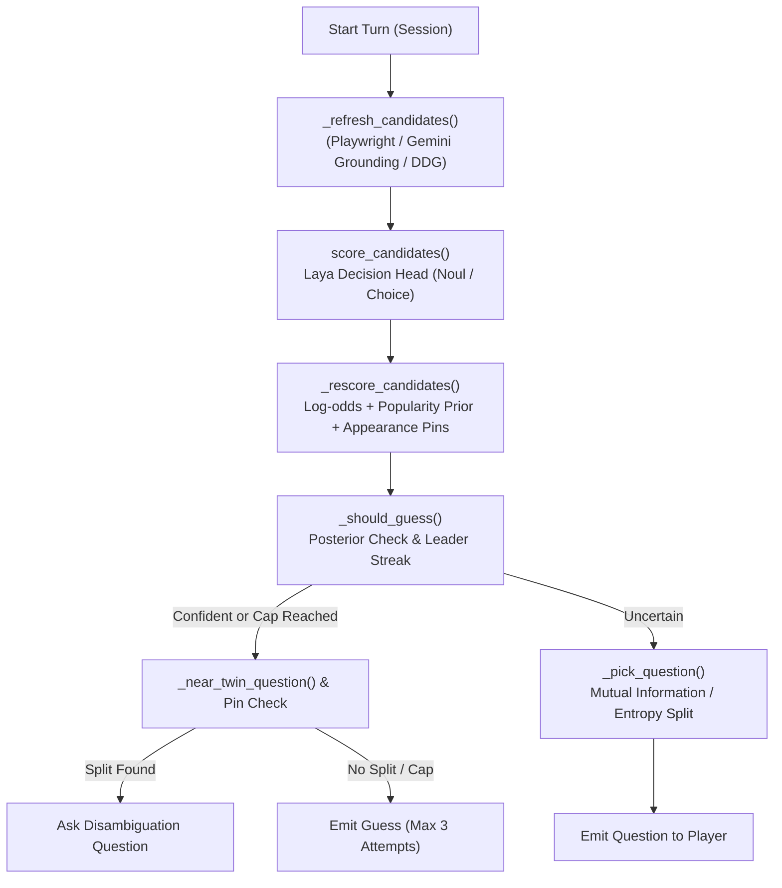

# Nekomimi Waifu Seeker — Live Validation & Bottleneck Analysis Report

**Date:** 2026-09-29  
**Deployment Environment:** Google Colab (NVIDIA L4 GPU, 23 GB VRAM)  
**Host URL:** `https://9514-136-110-17-194.ngrok-free.app/nekomimi`  
**Decision Engine:** Laya (`convaiinnovations/laya` ModernBERT-large 421M decision head)  
**Query Rewriter:** Unsloth `gemma-4-26B-A4B-it-GGUF:UD-Q3_K_M` on Ollama (~53.7 tok/s)  
**Grounding Sources:** Playwright Chromium + AniList + Wikipedia + DuckDuckGo + Gemini Search  

---

## 1. Executive Summary

A live validation test was conducted using the autonomous browser agent against 5 characters spanning 5 distinct franchises and media types (Anime, Manga, Light Novel, Video Game). The test evaluated cold-start guessing capability without free-text player seed clues.

- **Success Rate:** 40% (2/5 characters successfully deduced).
- **Fastest Win:** Rem (*Re:ZERO*) in **9 turns** (Confidence: 85%).
- **Second Win:** 2B (*NieR:Automata*) in **20 turns** (Guessed on attempt #2).
- **Key Bottlenecks Identified:** Series exclusion cold-start penalty, cluster peer / near-twin disambiguation budget exhaustion, and semantic mismatch in fantasy vs modern demon traits.

---

## 2. Validation Results by Character

| # | Character | Series | Media Type | Turns | Guesses Made | Outcome | Notes |
|---|---|---|---|:---:|---|:---:|---|
| 1 | **Rem** | *Re:ZERO* | Anime / Light Novel | 9 | 1. **Rem** (85%) | **PASS** | Series was present in initial 8 choices; rapid convergence. |
| 2 | **2B** | *NieR:Automata* | Video Game | 20 | 1. Abby (17%) 2. **2B** (16%) | **PASS** | Series unlisted. Abby guessed first on fame prior; 2B won on Guess 2. |
| 3 | **Makima** | *Chainsaw Man* | Anime / Manga | 20 | 1. Satanichia (26%) 2. Satania (21%) 3. Veldora (14%) | **FAIL** | "Demon" without horns/wings biased search to fantasy demons. |
| 4 | **Megumin** | *KonoSuba* | Anime / Light Novel | 20 | 1. Arue (62%) 2. Yunyun (63%) 3. Funifura (40%) | **FAIL** | Near-miss: Isolated exact Crimson Demon clan; 3 guesses burnt on peers. |
| 5 | **Tifa Lockhart** | *Final Fantasy VII* | Video Game | 20 | 1. Bayonetta (14%) 2. Yuna (10%) 3. Shamir (20%) | **FAIL** | Surfaced *Final Fantasy* cluster, but Bayonetta/Yuna took top posteriors. |

---

## 3. Detailed Round Dissection

### Round 1: Rem (*Re:ZERO -Starting Life in Another World-*)
- **Answer Trail:** Another series $\rightarrow$ Re:ZERO $\rightarrow$ Anime/manga $\rightarrow$ Female $\rightarrow$ Horns $\rightarrow$ Blue hair $\rightarrow$ Not human $\rightarrow$ Has a twin.
- **Observations:** At Question 9, Laya reached an 85% confidence score on Rem. The early series match restricted candidate search to the exact franchise, proving the engine is optimal when the franchise is pinned.

### Round 2: 2B / YoRHa No. 2 Type B (*NieR:Automata*)
- **Answer Trail:** Video game $\rightarrow$ Female $\rightarrow$ Not human $\rightarrow$ Robot/android/AI $\rightarrow$ Playable protagonist $\rightarrow$ Soldier/fighter $\rightarrow$ White/silver hair $\rightarrow$ Post-apocalyptic sci-fi.
- **Observations:** 2B entered the candidate pool around Turn 8 (7–8%) and reached 26% by Turn 12. At Turn 20, Abby (*The Last of Us*) held higher popularity prior weight and was guessed first. Rejection immediately promoted 2B, who was confirmed on Guess 2.

### Round 3: Makima (*Chainsaw Man*)
- **Answer Trail:** Anime/manga $\rightarrow$ Female $\rightarrow$ Demon/devil $\rightarrow$ Red/orange hair $\rightarrow$ Adult (not student/school) $\rightarrow$ Long hair.
- **Observations:** Makima led between Q5–Q7 (18–23%). However, answering "Demon/devil" without horns or wings biased search grounding toward classic comedy/supernatural demons (*Gabriel DropOut*, *Slime*). Makima was pushed down due to lower supernatural tag density.

### Round 4: Megumin (*KonoSuba*)
- **Answer Trail:** Anime/manga $\rightarrow$ Female $\rightarrow$ Brown hair $\rightarrow$ Red eyes $\rightarrow$ Able to use magic $\rightarrow$ Eyepatch.
- **Observations:** After the eyepatch question, the candidate pool isolated the *KonoSuba* Crimson Demon clan. However, Arue, Yunyun, and Funifura share almost identical tags in scraped blurbs. With Kazuma being the sole protagonist, answering "No" to the protagonist question reduced Megumin's log-odds relative to side characters. All 3 guesses were consumed on clan peers.

### Round 5: Tifa Lockhart (*Final Fantasy VII*)
- **Answer Trail:** Video game $\rightarrow$ Female $\rightarrow$ Japanese work $\rightarrow$ Fantasy $\rightarrow$ Black long hair $\rightarrow$ Playable martial artist/fighter $\rightarrow$ Not sword user.
- **Observations:** Identified Japanese fantasy RPG heroines and surfaced *Final Fantasy* (Yuna appeared in top pool), but prioritized *Bayonetta*, *Yuna*, and *Shamir* across the 3 guess attempts.

---

## 4. Architectural Bottleneck Analysis

### 1. The "Another Series" Cold-Start Penalty
- **Mechanism:** `traits.py` generates series choices from the top candidates currently in the live pool.
- **Deficiency:** On cold-start turn 1, candidates are generic top-fame characters. Unlisted franchises force the user to pick "Another series", which permanently exhausts the series question. The engine never asks "Which series?" again.

### 2. The "Cluster Peer Trap" (Near-Twin Exhaustion)
- **Mechanism:** When multiple candidates belong to the same franchise and share identical broad tags (hair color, school, magic), `_near_twin_question()` attempts to find an unasked trait from `_SERIES_SPLIT_QIDS`.
- **Deficiency:** If those specific traits are absent from the scraped blurbs or have already been asked, the engine falls back to guessing by raw posterior. With `MAX_GUESSES = 3`, guessing 3 close peers (e.g. Arue $\rightarrow$ Yunyun $\rightarrow$ Funifura) exhausts the session before the true target is reached.

### 3. Popularity Prior Dampening
- **Mechanism:** `_dampen_split_soft_cast` flattens popularity priors when characters share a work.
- **Deficiency:** This causes world-famous headliners (e.g., Megumin) to lose their natural probability advantage over minor side characters (e.g., Arue, Funifura) when visual tags match equally well.

### 4. Search Grounding Tag Mismatch
- **Mechanism:** Query grounding via Wikipedia/AniList indexes correlates "demon" with classic horned/winged supernatural fantasy tropes.
- **Deficiency:** Modern urban characters with non-traditional demon lore (such as Makima wearing a business suit) suffer severe likelihood penalties when the player answers "no" to wings/horns.

---

## 5. System Latency Profile

| Stage | Technology | Measured Latency | Bottleneck Evaluation |
|---|---|---|---|
| **Laya Inference** | Local PyTorch ModernBERT on L4 GPU | $\sim 16\text{ ms} \text{ / batch}$ | ⚡ Zero bottleneck. |
| **Query Rewriter** | Local Ollama GGUF (Gemma 26B) | $\sim 0.5\text{ s} \text{ / call}$ | ✅ Non-blocking worker. |
| **Search Retrieval** | Playwright + Gemini Grounding + DDG | $\sim 1.5\text{--}3.5\text{ s} \text{ / turn}$ | ⚠️ Moderate network I/O latency. |
| **Disambiguation Logic** | Near-twin & recovery heuristics | $< 1\text{ ms}$ | ❌ Functional logic bottleneck. |

---

## 6. Actionable Recommendations

1. **Re-prompt Series after Convergence:**
   Allow the engine to re-ask "Which series?" around Turn 8–10 once the candidate pool has narrowed to a specific genre/cluster.
2. **Dynamic In-Cluster Feature Disambiguation:**
   When the top 3 candidates belong to the same franchise ($P(\text{Franchise}) > 70\%$), extract unique differentiating phrases from their respective blurbs (e.g. *"explosion magic"* vs *"crimson eye sealed power"*) and formulate dynamic yes/no questions before emitting a guess.
3. **Preserve Relative Fame for Faction Peers:**
   Ensure title characters and central party members maintain a minimum prior offset over minor recurring characters when broad visual tags are tied.

---

## 7. Resolution (decision flow rework)

A code review of the three failures found one primary cause that Section 4 does not name, and one claim that does not hold.

### Primary cause: the guess cascade at the turn cap
All three failed rounds hit turn 20 with no guess, then used all three guesses **back to back with no question in between**. At `turn >= MAX_TURNS`, `_should_guess` always returned True, and recovery, near-twin defer and the pin path were all disabled at the cap. So guesses 2 and 3 were just posterior ranks #2 and #3 of the same evidence (Arue → Yunyun → Funifura).

### Corrections to Section 4
- **§4.3 (popularity dampening) does not apply to Megumin.** `_dampen_split_soft_cast` only acts on lexicon look-pin casts (`_appearance_pin`), and the Crimson Demons have none. The popularity prior (0.22·log10(favourites), cap 1.5) still gives Megumin about +0.5 log-odds over Arue.
- **§4.1:** "Which series?" could already be asked a second time after "Another series". It simply never won the information-gain ranking.
- **§4.4** (demon search grounding) is a search-source issue. The new hypothesis source below covers the case where button facts cannot be name-searched.

### Changes
| Change | Where | Addresses |
|---|---|---|
| `turn_cap()` = `MAX_TURNS` + 2 per wrong guess (`WAIFU_NEKOMINI_RECOVERY_TURNS`) | `session.py`, `engine._should_guess` / `_advance` | Guess cascade (Megumin, Makima, Tifa) |
| Laya-scored lookahead EIG for question choice: top-K candidates × shortlist, one Laya pass per candidate | `engine._lookahead_eig`, `_pick_question` | Question choice ignored Laya's likelihoods (BED-LLM's key ablation) |
| Guess when no shortlisted question can separate the top (gain < 0.05 bits) | `engine._should_guess` | Turns wasted on a settled pool |
| In-cluster split when rare looks do not separate a same-work leader | `engine._cluster_split_question` | Cluster peer trap (§4.2) |
| "Which series?" pinned from turn 6 once one series holds ≥ 0.35 mass | `engine._series_pin_id` | Series never asked (§4.1, Tifa) |
| Local LLM proposes candidate **names** from player facts, resolved on AniList/Wikipedia | `query_llm.propose_characters`, `sources/llm_names.py` | Cold-start pool from fame lists only (Makima, 2B, Tifa) |
| Default local model: Unsloth Gemma 4 26B-A4B GGUF on Ollama; thinking off natively | `query_llm.py` | Faster than Qwen3.6-35B-A3B at long context; fits the L4 |

The LLM still never writes question text and never decides: question wording stays in `question_bank.json`, and Laya scores every candidate the LLM proposes.

### Research basis
- [BED-LLM](https://arxiv.org/abs/2508.21184): EIG from a prior × likelihood model, filtered beliefs, hypothesis retention. It took 20Q success from 45% (prompt-only) to 93%.
- [Uncertainty of Thoughts](https://arxiv.org/abs/2402.03271): information-gain lookahead over simulated answers.
- [ASIG](https://arxiv.org/html/2607.03426): amortised BED, 25–36× cheaper per turn. A possible later step is distilling the lookahead into Laya.

### Next validation
Rerun the same five characters on Colab (L4, Ollama Gemma, `WAIFU_QUERY_LLM=1`) and compare wins, turns to win, the `pick.eig` span and the `llm_bg` hits against the 2/5 baseline.

### Evidence to collect on the rerun
The first rerun could not say why Makima, Megumin and Tifa were missed. For each round (3 per character):
- After the round ends, save `GET /api/nekomimi/trace/{session_id}?target=<name>`. It gives the target's rank after every answer and, for each wrong guess, which answers put that guess ahead of the target (`gap`, most harmful first).
- Save `/content/server.log`. Its `[waifu]` lines carry `eig_calls` / `eig_qs` next to `laya.eig` and `laya.lock_wait`, `dup=` (source hits already in play), and the `llm_names background ... proposed= resolved= unresolved= names=[...]` funnel.
- Report question turns and guesses separately. `trace.questions` counts questions; `turn_cap` bounds them.
